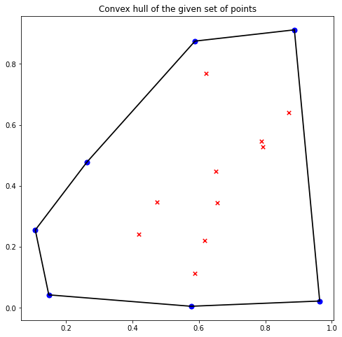
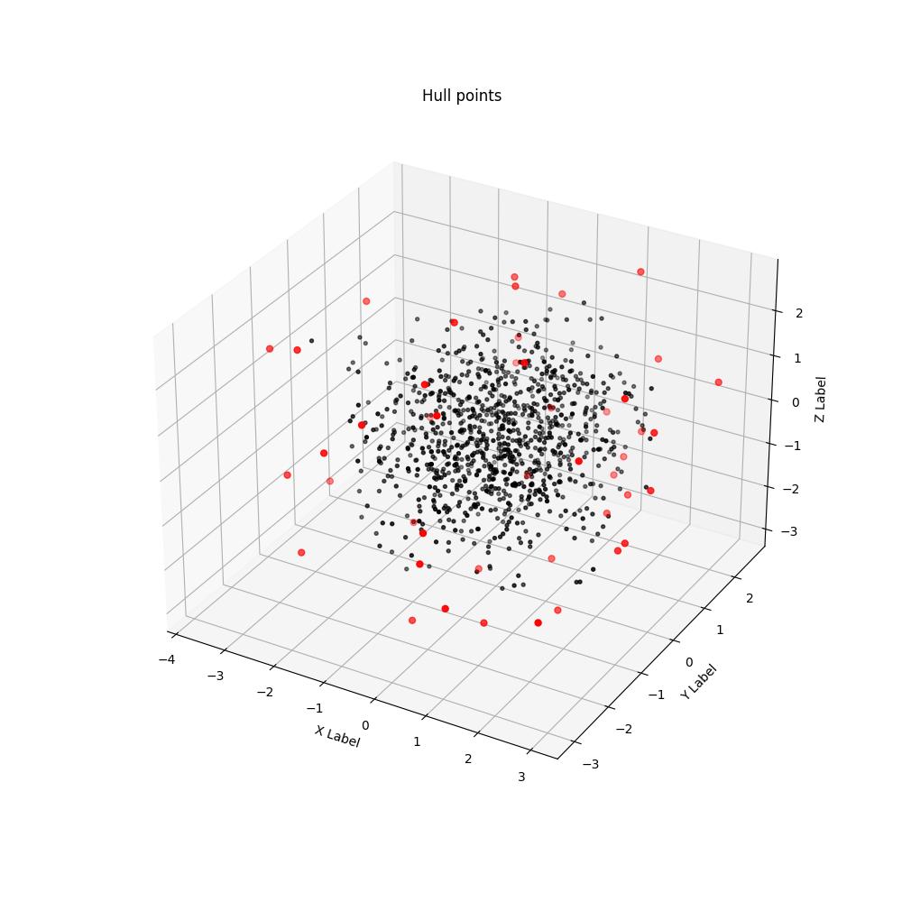

# Convex_Hull

This repository contains two gift-wrapping inspired Convex hull algorithms ifor point clouds in 2D and 3D space. You can find more about the process behind it and the homebrewed algorithm recipe on <a href="https://deepikaananth.github.io/posts/2015-08-12-2D-Convex-Hull.html">my website</a>
 
 
An example of the generated **2D convex hull** for a small set of points
 
 

  

An example of the generated **3D convex hull** for a randomly generated 3D point cloud:

  

